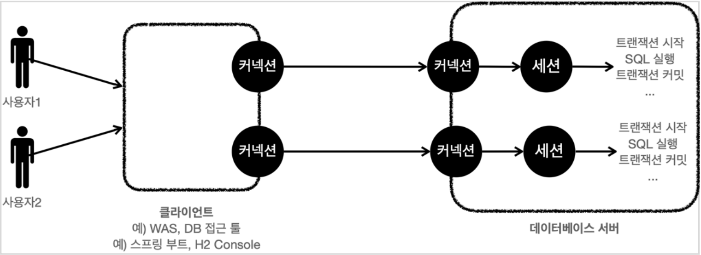

# 트랜잭션
## 트랜잭션 - 개념이해
- 데이터베이스에서 트랜잭션은 하나의 거래를 안전하게 처리하도록 보장해주는 것이다.

예를 들어 A의 5000원을 B에게 계좌이체 할 경우
  1. A의 잔고를 5000원 감소
  2. B의 잔고를 5000원 증가
- 1번은 성공하고 2번에서 시스템에 문제가 발생하면 A의 잔고만 5000원 감소하는 문제가 발생한다.
- 데이터베이스가 제공하는 트랜잭션 기능을 사용하면 중간에 하나라도 실패하면 거래 전의 상태로 돌아갈 수 있다.
- 모든 작업이 성공해서 데이터베이스에 정상 반영하는 것을 **커밋**
- 작업 중 하나라도 실패해서 거래 이전으로 되돌리는 것을 **롤백** 이라한다.

### 트랜잭션 ACID
트랜잭션은 ACID를 보장한다.
- **Atomivity(원자성)** : 트랜잭션 내에서 실행한 작업들은 마치 하나의 작업인 것처럼 모두 성공하거나 모두 실패해야 한다.
- **Consistency(일관성)** : 모든 트랜잭션은 일관성 있는 데이터베이스 상태를 유지해야 한다. ex)무결성 제약 조건을 항상 만족한다.
- **Isolation(격리성)** : 동시에 실행되는 트랜잭션들이 서로에게 영향을 미치지 않도록 격리한다. ex)동시에 같은 데이터를 수정하지 못하도록 한다.
격리성은 성능이슈로 인해 트랜잭션 격리 수준(Isolation Level)을 선택할 수 있다.
- **Durability(지속성)** : 트랜잭션을 성공적으로 끝내면 그 결과가 항상 기록되어야 한다. 중간에 문제가 발생해도 데이터베이스 로그 등을 사용해
성공한 트랜잭션 내용을 복구해야 한다.

격리성을 완전히 보장하려면 트랜잭션을 거의 순서대로 실행해야 한다. 이렇게 하면 동시 처리 성능이 나빠진다.
이런 문제로 인해 ANSI 표준은 트랜잭션의 격리 수준을 4단계로 나누어 정의했다.

#### 트랜잭션 격리 수준 - Isolation level
- READ UNCOMMITED (커밋되지 않은 읽기)
- READ COMMITTED (커밋된 읽기)
- REPEATABLE READ (반복 가능한 읽기)
- SERIALIZABLE (직렬화 가능)

## 데이터베이스 연결 구조와 DB 세션
### 데이터베이스 연결 구조 1

- 클라이언트가 데이터베이스 서버에 연결을 요청해 커넥션을 맺는다. 서버 내부에 세션이 형성되고 해당 커넥션을 통한 모든 요청은 세션을 통해 실행된다.
- 쉽게 말하면 개발자가 클라이언트를 통해 SQL을 전달하면 세션이 SQL을 실행한다.
- 세션이 트랜잭션 시작. 커밋, 롤백을 통해 트랜잭션을 종료한다. 이후 새 트랜잭션을 다시 시작한다.
- 사용자가 커넥션을 닫거나, 또는 DB 관리자가 세션을 강제로 종료하면 세션은 종료된다.
### 데이터베이스 연결 구조 2

- 커넥션 풀이 10개의 커넥션을 생성하면, 세션도 10개 만들어진다.

### 자동커밋, 수동커밋
자동커밋: 각각의 쿼리 실행 직후에 자동으로 커밋을 호출한다. 따라서 커밋이나 롤백을 직접 호출하지 않아도 된다.
하지만 쿼리 하나하나가 자동으로 커밋되기 때문에 우리가 원하는 트랜잭션 기능으 제대로 사용할 수 없다.
- 자동 커밋 설정
```SQL
SET autocommit true; //자동 커밋 모드 설정
insert into member(member_id, money) values ('data1',1000);
insert into member(member_id, money) values ('data2',1000);
```
- 수동 커밋 설정
```SQL
SET autocommit false; //수동 커밋 모드 설정
insert into member(member_id, money) values ('data1',1000);
insert into member(member_id, money) values ('data2',1000);
commit;
```
자동 커밋 모드가 기본 설정이기 때문에, 수동 커밋으로 설정하는 것을 **트랜잭션을 시작** 한다고 표현할 수 있다.
수동 커밋 / 자동커밋 모드는 한번 설정하면 해당 세션에서는 계속 유지된다. 중간에 변경하는 것은 가능하다.
### DB 락
세션이 트랜잭션을 시작하고 데이터를 수정하는 동안에는 커밋이나 롤백 하기 전까지
다른 세션에서 해당 데이터를 수정하게 되면 문제갸 생긴다.
이런 문제를 해결하기 위한 것이 **락**(Lock)이다.

#### 락 예시
세션 1은 "memberA"의 금액을 500원으로 변경하고 싶고, 세션 2는 1000원으로 변경하고 싶다.
1. 세션 1은 트랜잭션을 시작한다.
2. 세션 1은 memberA의 money를 500으로 변경을 시도한다. 이때 해당 로우의 락을 먼저 획득해야 한다. 
세션1이 세션2보다 조금 더 빨리 요청했기 때문에 남아있는 락을 세션 1이 획득한다.
3. 세션 1은 락을 획득했으므로 해당 로우에 update sql을 수행한다.
---
4. 세션 2는 트랜잭션을 시작한다.
5. 세션 2도 memberA의 money를 변경하려고 시도하는데, 락이 없으므로 대기한다.
6. 세션 2가 락을 무한정 대기하는 것은 아니다. 락 대기 시간이 넘어가면 락 타임아웃 오류가 발생한다. 
락 대기시간은 설정할 수 있다.
---
7. 세션 1은 커밋을 수행한다. 트랜잭션이 종료되었으므로 락도 반납한다.
8. 대기하던 세션2가 락을 획득한다.
9. 세션2가 update sql을 수행한다.
10. 세션2는 커밋을 수행하고 락을 반납한다.

### DB 락 - 변경
```sql
SET LOCK_TIMEOUT 60000; //락 획득시간을 60초로 설정한다. 60초 안에 락을 얻지 못하면 예외 발생
SET autocommit false;
update member set money=1000 where member_id='memberA';
```
### DB 락 - 조회
"일반적인 조회는 락을 사용하지 않는다."